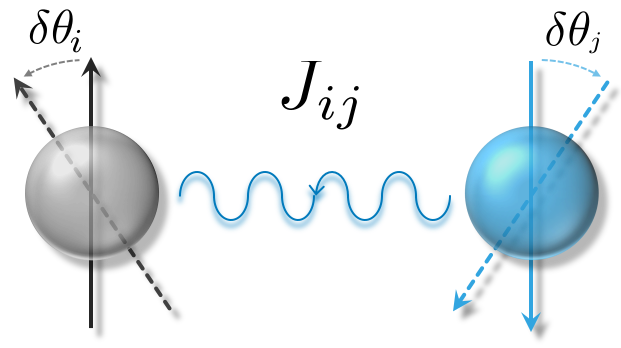

# **JX**
  
## Quick start
### How to install
- `./install.sh`

### How to run example
- `./example_NiO_OpenMX.sh`


[Homepage & How to use](https://kaist-elst.github.io/DFTforge.jl/)

## MFT (Magentic force theory)


**JX** Calculate spin exchange coupling parameters *J* from [OpenMX](http://www.openmx-square.org/) DFT/Wannier, [Wannier90](http://www.wannier.org/) hamiltonians via magnetic force linear response calculations.

We support the following features:
- *J* in short- and long-range interactions in realspace via momentum space calculation.
- Orbital resolved *J*
- Local axis redefinition for orbital resolved *J*
- Full [OpenMX](http://www.openmx-square.org/) DFT Hamiltonian and Wannier Hamiltonian ([OpenMX](http://www.openmx-square.org/)/[Wannier90](http://www.wannier.org/))


---


## Install and Usage
### Prerequisites
1. Linux or OSX (Windows is not supported due to some Julia packages).
1. Install `hdf5` lib before the following install steps
  (e.g. in Ubuntu `apt-get install hdf5-tools`, OSX `brew install hdf5`).


### Installing

The `install.sh` script will perform two things:
1. Automatically install the most recent version of [`Julia program language`](https://julialang.org/)
1. Install required `Julia` packages and **JX** by `julia install.jl`

If Julia is already installed, skip 1 and just type `julia install.jl`.

### Running the NiO example **Jx**

Two calculations are performed to obtain *J* in realspace.
Here, we follow the NiO:`./example_NiO_OpenMX.sh` example.

1. Calculates *J* in momentum space *J*(q) by:

 `julia -p 4 src/Jx_col_spin_exchange.jl  -T examples/NiO_G-AFM_U0.OpenMx/nio_J_openmx.toml`

  The output files (`jx.col.spin_{$name}_atomij_{$atom1}_{$atom2}_[all_all]_ChemPdelta_0.0.jld2`) will be stored in subfolder named by `jx.col.spin_0.0`.

2. Transfrom *J*(q) to realspace *J*(Rij) by:

 `julia  src/Jx_postprocess.jl --cellvectors  2_2_2 --baseatom1 1 --atom2 1,2 --orbital_name all_all  examples/NiO_G-AFM_U0.OpenMx/jx.col.spin_0.0`

  The *J*(q) data stored in `*.jld2` files will be transformed into *J*(Rij) and stored in `csv` format.
  Also *J*(Rij) will be plotted in `pdf` and `svg` format.

## Directory layout
  ```bash
  .
  ├── LICENSE
  ├── install.sh   # Installer: install Julia & run `julia install.jl`
  ├── install.jl   # `julia install.jl` will install required packages and `DFTforge.jl`
  ├── Readme.md
  ├── example_NiO_OpenMX.sh
  ├── examples    # Example folder   
  │   └── NiO_G-AFM_U0.OpenMx
  │       ├── nio_J_openmx.toml      # Jx input file for OpenMX `scfout` file
  │       ├── nio_J_wannier.toml     # Jx input file for OpenMX Wannier
  │       └── nio_dft_result.tar.xz  # Compressed example Hamiltonian files
  ├── ext
  │   └── TOML                       # Julia TOML Pkg
  ├── Project.toml                   # Julia packages dependency description
  └── src
      ├── DFTcommon.jl               # Contains constants values & common data structures & etc
      ├── DFTforge.jl                # API for H(k), En(k), 𝚿(k), ...
      ├── DFTrefinery.jl             # Parallelized API for H(k), En(k), 𝚿(k), ...
      ├── Jx_col_spin_exchange.jl    # 1. Jx MFT program that calculates J(q)
      ├── Jx_postprocess.jl          # 2. transform J(q) -> J(R) & plot the results
      ├── backend                    # Hamiltonian file reading interfaces
      │   ├── EcalJ_PostCommon.jl
      │   ├── OpenMX_PostCommon.jl
      │   ├── OpenMX_read_scf.jl
      │   ├── Wannier_PostCommon.jl
      │   └── Wannier_read.jl
      ├── basisTransform.jl          # Rotation of local axis
      ├── inputHandler.jl            # Reads the input `toml` file
      └── resultExport.jl            # Result exporter

  ```  
## License
  This project is licensed under the LGPL License - see the [LICENSE](LICENSE) file for details

## Author
- Hongkee Yoon Hongkeeyoon@kaist.ac.kr

## Version
- Current version works with Julia 1.0 & 1.1.
For future updated versions, please visit [https://kaist-elst.github.io/DFTforge.jl/](https://kaist-elst.github.io/DFTforge.jl/) for details.
